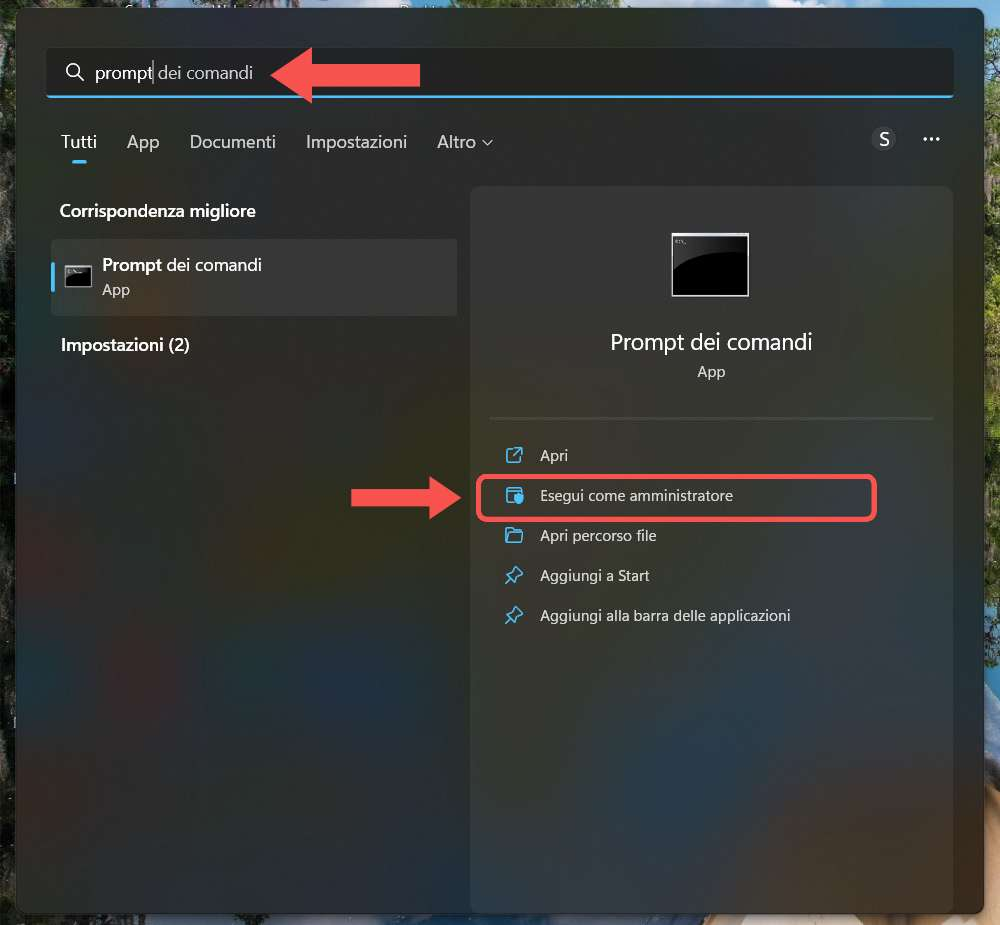
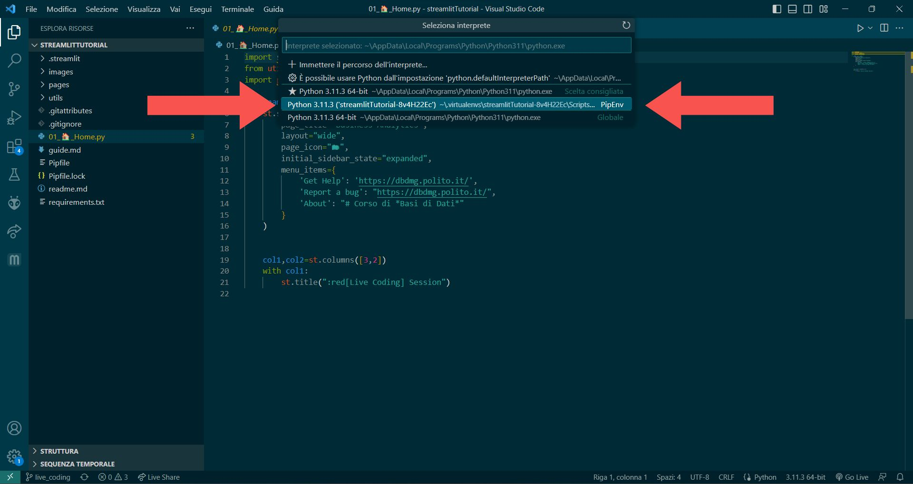

# Streamlit su Windows

## 1. Preparativi
-  Installare [Docker Desktop](https://www.docker.com/products/docker-desktop/)

- Installare [Python3](https://www.python.org/downloads/)

Controlla impostazioni da foto per installazione con PATH, segnarsi percorso di installazione evidenziato in foto.
Assicurarsi anche di attivare "Add Python.exe to PATH"


- Installare [git](https://git-scm.com/download/win), selezionando la versione windows 64bit

- **RIAVVIARE IL COMPUTER**

- Avviare Docker Desktop


:warning: :warning: :warning:
se l'avvio di Docker da' un errore riguardante un aggiornamento usare prompt dei comandi COME AMMINISTRATORE e eseguire
``` bash
wsl --update --web-download
```


Avviare nuovamente Docker Desktop e attendere che finisca il caricamento

:warning: :warning: :warning:

<br>

## 2. Prompt dei comandi
Ogni comando va eseguito nel prompt dei comandi, premendo ENTER per eseguirlo, finchè non appare il nome utente come ultima riga il comando è ancora in esecuzione, lasciar caricare
Per aprire il prompt corretto:

``` bash
mkdir bdd_streamlit
cd bdd_streamlit
git clone https://github.com/AndreaAvignone/mysql-docker.git
cd mysql-docker
docker compose up -d
```

con questi comandi abbiamo creato la cartella `bdd_streamlit` che conterrà tutti i nostri file del progetto streamlit. Con l'ultimo comando abbiamo avviato i container Docker per il DB `mysql` e per `phpmyadmin`. L'interfaccia di phpmyadmin è disponibile all'indirizzo `localhost:8081` accessibile con username `student` e password `user_pwd`

Ora copiamo i file del progetto streamlit<br>
``` bash
cd ..  
git clone https://github.com/AndreaAvignone/streamlitTutorial.git  
cd streamlitTutorial  
git checkout live_coding  
py -m pip install pipenv  
pipenv --python <Percorso della foto di installazione di python>\python.exe shell  
pip install -r requirements.txt  
python -m streamlit run 01_🏠_Home.py  

```	
il percorso al comando 6 sarà quindi simile a questo:
``` bash
pipenv --python C:\Users\<nome utente>\AppData\Local\Programs\Python\Python311\python.exe shell
```
Fatto questo tutto dovrebbe funzionare correttamente e aprire in automatico la pagina di streamlit

<br>

## (Facoltativo) Editare con VSCode
Sarà anche possibile aprire i file in VS Code per editarli in modo facile.
Di default la cartella di installazione sarà questa:  
`C:\Users\<nome_utente>\bdd_streamlit\streamlitTutorial`
Una volta aperta la cartella corretta bisognerà solo selezionare l'interprete Python corretto in modo che riconosca l'ambiente `pipenv` in cui abbiamo installato le dipendenze

Selezionare ora l'interprete corretto, è quello con **PipEnv come indicatore al fondo**


<br>

## 3. Avvio di Streamlit successivamente
Per riavviare streamlit le volte successive (dopo un riavvio del pc o se chiudi il terminale) sarà necessario:

1. Avviare Docker Desktop
2. Aprire prompt comandi
3. `cd bdd_streamlit`
4. `cd mysql-docker`
5. `docker compose up -d`
6. `cd ..`
7. `cd streamlitTutorial`
8. `pipenv --python <Percorso della foto>\python.exe shell`
9. `python -m streamlit run 01_🏠_Home.py`